  

  
  
  
  

# 🏥 Awesome Medical Device Quality Management Systems (eQMS) 🚀

## 🩺 Top Medical Device Quality Management Platforms Ecosystem 📋

**Curated List of SaaS Products & Open-Source GitHub Projects**  
*Focused on eQMS, Design Controls, CAPA, Risk Management (ISO 14971), Document Control, ISO 13485 & FDA QMSR Compliance (21 CFR Part 820)* 

📅 **Last updated: September 2026**

---

## 📌 Overview & Introduction

This repository tracks notable **SaaS platforms** ☁️ and **open-source projects** 🔓 for **Medical Device Quality Management Systems (eQMS)**. These software solutions help medtech, biotech, and software-as-a-medical-device (SaMD) companies maintain compliance with **ISO 13485**, **FDA QMSR (21 CFR Part 820)**, **EU MDR/IVDR**, and **ISO 14971**. 

### 🔑 Key Functional Areas Covered
* 📑 **Document Control & E-Signatures**: FDA 21 CFR Part 11 and Annex 11 compliant approval workflows.
* 🛠️ **Design Controls & DHF**: Traceability matrices connecting user needs, design inputs, design outputs, and verification/validation tests.
* ⚠️ **Risk Management**: Risk analysis, ISO 14971 compliance, and FMEA toolkits.
* 🔄 **CAPA & Nonconformance**: Root cause analysis, deviation tracking, and corrective/preventive actions.
* 🎓 **Training Management**: Automated training assignments and compliance verification on revised SOPs.
* 🔍 **Audit & Supplier Management**: Internal audit scheduling, findings management, and approved vendor lists (AVL).

---

## 📑 Table of Contents

- [☁️ SaaS / Hosted eQMS Platforms](#-saas--hosted-eqms-platforms)
- [🔓 Open-Source GitHub Projects](#-open-source-github-projects)
- [🤝 How to Contribute](#-how-to-contribute)
- [⚠️ Disclaimer](#%EF%B8%8F-disclaimer)

---

## ☁️ SaaS / Hosted eQMS Platforms

### 📈 Market Size & Industry Dynamics
The global **Enterprise Quality Management Software (EQMS)** market size is estimated at **~$10.5 Billion** and is projected to grow to over **$21 Billion by 2032** (CAGR of ~9.2%). The medical device & life sciences eQMS sub-sector is **moderately fragmented**, with key enterprise market leaders (such as Veeva, Honeywell/Sparta, PTC/Arena, Hexagon/ETQ, and MasterControl) alongside fast-growing medtech-focused cloud platforms (Greenlight Guru, Qualio, QT9). Consolidation through M&A is active as large conglomerates acquire specialized quality platforms.

### 📊 SaaS Product Comparison Table

| Product 🏢 | Company Size / Revenue / Valuation 💰 | Starting Pricing 💵 | Free Tier / Trial Limit ⏳ | Key Features & Focus 🌟 |
| :--- | :--- | :--- | :--- | :--- |
| **[Veeva QualityOne](https://www.veeva.com/)** | **~$3.2B Annual Revenue** (~$43B Market Cap) | Custom Enterprise Quote (contact sales) | **No Free Trial** (sales demos available upon request) | Unified cloud quality solution within Veeva Vault ecosystem for document control, audit, and quality processes. |
| **[Sparta TrackWise](https://www.honeywell.com/)** | **$1.3B Acquisition Valuation** (Acquired by Honeywell) | Custom Enterprise Quote (approx. $25k+/yr base) | **No Free Trial** (custom enterprise demonstration available) | Industry standard enterprise eQMS for deviation, CAPA, complaints, and audit management in life sciences. |
| **[ETQ Reliance](https://www.etq.com/)** | **$1.2B Acquisition Valuation** ($75M+ Annual Revenue, Hexagon) | Custom Enterprise Quote (negotiated per module) | **No Free Trial** (guided live demo available) | Highly configurable cloud eQMS covering document control, CAPA, risk, and supplier quality. |
| **[MasterControl](https://www.mastercontrol.com/)** | **$1.3B Valuation** ($200M Annual Recurring Revenue) | Starts at **~$25,000 / year** (entry package estimate) | **No Free Trial** (guided sales demonstration available) | Enterprise quality & manufacturing software extensively used for document control, CAPA, and training. |
| **[Arena QMS (PTC)](https://www.ptc.com/)** | **$715M Acquisition Valuation** ($50M+ ARR, PTC Inc.) | Custom Quote (tiered by user and module count) | **Free Trial Available** (evaluation period upon sales approval) | Integrated QMS & PLM product lifecycle platform for medical device hardware and electronic design. |
| **[Greenlight Guru](https://www.greenlight.guru/)** | **~$16M Annual Revenue** ($121M Total Raised) | Starts at **~$25,000 / year** (base platform estimate) | **No Free Trial** (live interactive software demo available) | Purpose-built medtech eQMS for design controls, ISO 14971 risk management, ISO 13485 & FDA QMSR. |
| **[Qualio](https://www.qualio.com/)** | **~$15M Annual Revenue** ($60M+ Total Raised) | Starts at **~$12,000 / year** (base plan estimate) | **No Free Trial** (custom software demonstration available) | Cloud eQMS tailored for growing life sciences and medtech startups for document control & CAPA. |
| **[QT9 QMS](https://qt9software.com/)** | **~$10M Annual Revenue** (Private / Bootstrapped) | Starts at **~$2,200 / user / year** (anchor estimate) | **Free Trial Available** (full-featured free trial provided) | Modular cloud QMS offering document control, CAPA, audits, calibration, and training management. |
| **[ComplianceQuest](https://www.compliancequest.com/)** | **~$10M Annual Revenue** (Built on Salesforce) | Custom Quote (per user / module pricing) | **No Free Trial** (personalized demo on request) | Salesforce-native eQMS leveraging AI for document management, CAPA, and supplier quality. |
| **[Qualtrax](https://www.qualtrax.com/)** | **~$8M Annual Revenue** (Ideagen Group) | Custom Quote (based on user licenses) | **No Free Trial** (custom demo & evaluation available) | Compliance and document control software specialized for testing laboratories and quality audits. |
| **[Allowly](https://allowly.ai/use-cases/gxp-ai-agent-controls/)** | Private company; revenue/valuation not public | Free; paid plans from **$9/month** | Free plan: **1 active item and 1,000 lifetime decisions** | Policy checks before consequential AI-agent actions and signed records for submitted decisions; customer systems enforce results and validate intended use. Not a full eQMS. |

---

## 🔓 Open-Source GitHub Projects

*Note: While open-source frameworks and templates provide great documentation discipline, fully compliant FDA/ISO medical device eQMS platforms require strict validation, electronic signatures (21 CFR Part 11), and audit trail controls.*

### ⭐ Open-Source Projects Sorted by GitHub_Stars

| Project / Repository 📦 | GitHub Stars_Count 🌟 | License 📜 | Description & Use Case 💡 |
| :--- | :--- | :--- | :--- |
| **[Odoo Quality Modules](https://github.com/odoo/odoo)** |  | LGPL-3.0 | Enterprise open-source ERP with quality inspection, non-conformance, and audit tracking modules. |
| **[ERPNext Quality Features](https://github.com/frappe/erpnext)** |  | GPL-3.0 | Open-source ERP framework featuring quality inspection, procedure logging, and inventory control. |
| **[Doorstop Requirements Manager](https://github.com/doorstop-dev/doorstop)** |  | LGPL-3.0 | Text-based requirements management tool for version-controlled design traceability (DHF & Design Controls). |
| **[Innolitics Regulatory Doc Manager (RDM)](https://github.com/innolitics/rdm)** |  | MIT | Documentation-as-code CLI tool for managing IEC 62304 & FDA 510(k) regulatory documentation in Markdown. |
| **[GSTT-CSC SaMD QMS Template](https://github.com/GSTT-CSC/QMS-Template)** |  | MIT | ISO 13485 audited QMS template for Software as a Medical Device (SaMD) by NHS Guy's & St Thomas'. |
| **[QAtrial Quality Platform](https://github.com/MeyerThorsten/QAtrial)** |  | AGPL-3.0 | Open-source web platform for design control, test management, CAPA, and audit trails in regulated sectors. |
| **[DearAuditor QMS Baseline](https://github.com/AliakseiT/dearauditor-qms-baseline)** |  | MIT | Git-native eQMS template enforcing ISO 13485, ISO 14971, and IEC 62304 workflows via GitHub PRs & Actions. |

### 🛠️ Hybrid Implementation Frameworks
* **Git-Based Documentation Scaffolds**: Enforce review discipline for SOPs and work instructions using Markdown, Git branch protections, and PR approvals.
* **Open Risk Toolkits**: Generate ISO 14971 compliant hazard analysis and FMEA tables using open-source Python scripts feeding into formal DHF repositories.

---

## 🤝 How to Contribute

Contributions are welcome! Please follow these steps to add or update eQMS software listings:

1. **Fork** this repository. 🍴
2. **Add/Edit** entries in `README.md` following the existing tabular structure. ✏️
3. Ensure descriptions are **factual**, include links to official pages, and supply verifiable pricing/trial details. 🔍
4. **Submit a Pull Request** with a clear explanation of your changes. 🚀

⭐ **Star this repository** if you find it helpful for your medical device compliance journey!

---

## ⚠️ Disclaimer

- This repository is a **community-curated list** — it is not exhaustive and does not constitute an endorsement. 💡
- **Regulatory Caution**: Medical device quality management systems are subject to strict regulatory enforcement (FDA QMSR, ISO 13485, EU MDR 2017/745). Open-source or self-built tools are **not** audit-ready out-of-the-box without full software validation (CSV/CSA), procedural controls, and regulatory sign-off. Using non-validated systems for GxP electronic records poses severe compliance risks. This list does not constitute legal or regulatory advice. 🛡️

---

## 📈 Star History

---

## 💖 Support & Sponsorship

Thank you for exploring the **Awesome Medical Device Quality Management** repository! 🌟

If you find this ecosystem list helpful for your regulatory, quality compliance, or medical device engineering work:
- ⭐ **Star this repository** to help others discover it!
- 🔀 **Fork and contribute** to keep the eQMS resources updated.
- 📢 **Share it** with your colleagues, quality management, and medtech community.

---

  <b>Made with ❤️ for Quality, Regulatory, and MedTech Engineering Teams.</b> 
  <i>Keeping medical device quality rigorous, traceable, and audit-ready.</i>

